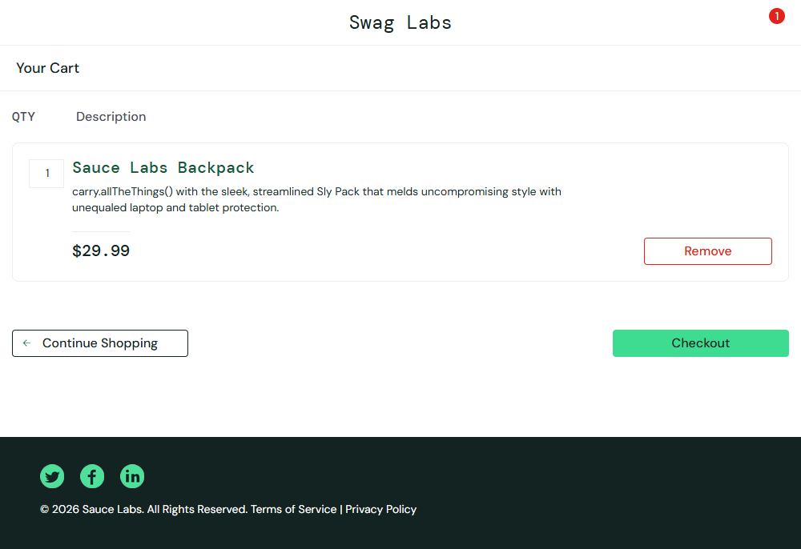
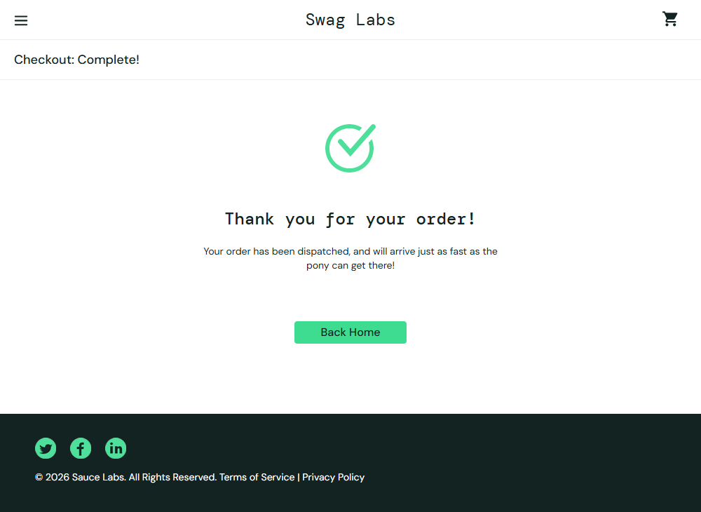

# Cypress E-commerce Automation Framework

## Project Overview
This project demonstrates end-to-end automation testing of an e-commerce web application using Cypress. It covers login, cart functionality, and checkout flow.

## Application Under Test
 https://www.saucedemo.com/
-----------------------------------------
## Test Coverage
### Login Tests

* Valid login
* Invalid login

### Cart Tests

* Add product to cart
* Remove product from cart

### Checkout Flow

* Complete end-to-end purchase
* Validate order success

## Tech Stack

* Cypress
* JavaScript
* Node.js

## Framework Features

* Custom Commands (Reusable functions)
* Fixtures (Test data management)
* beforeEach hook for setup
* Clean and scalable structure

## Test Execution Screenshots

### Cart Page


### Order Success


## How to Run

```bash
npm install
npx cypress open
```

## Future Enhancements

* API testing integration
* CI/CD (GitHub Actions)
* Cross-browser execution

---

## Author

Saikamala
